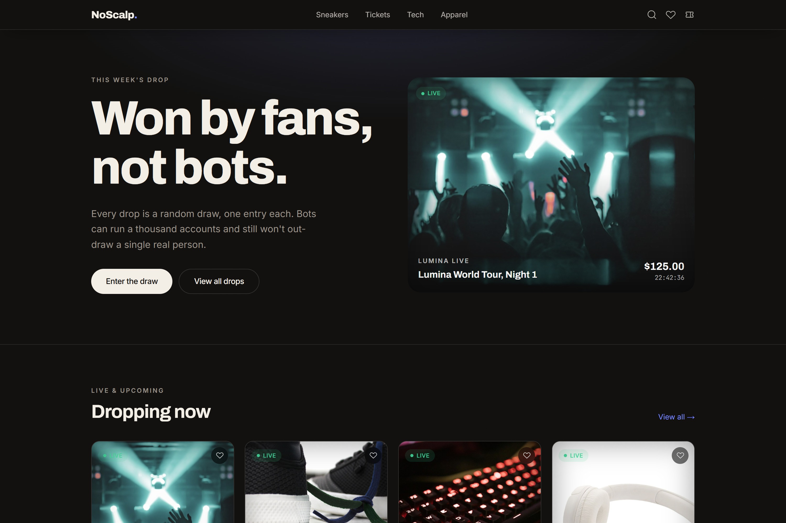
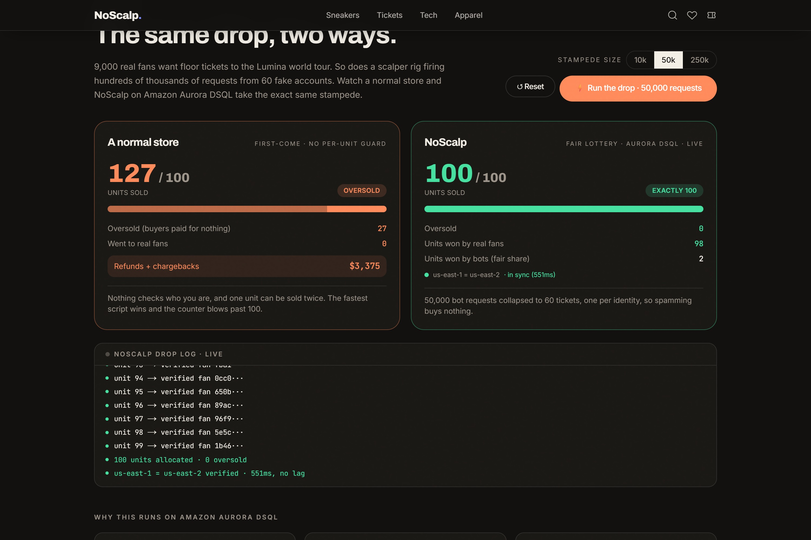
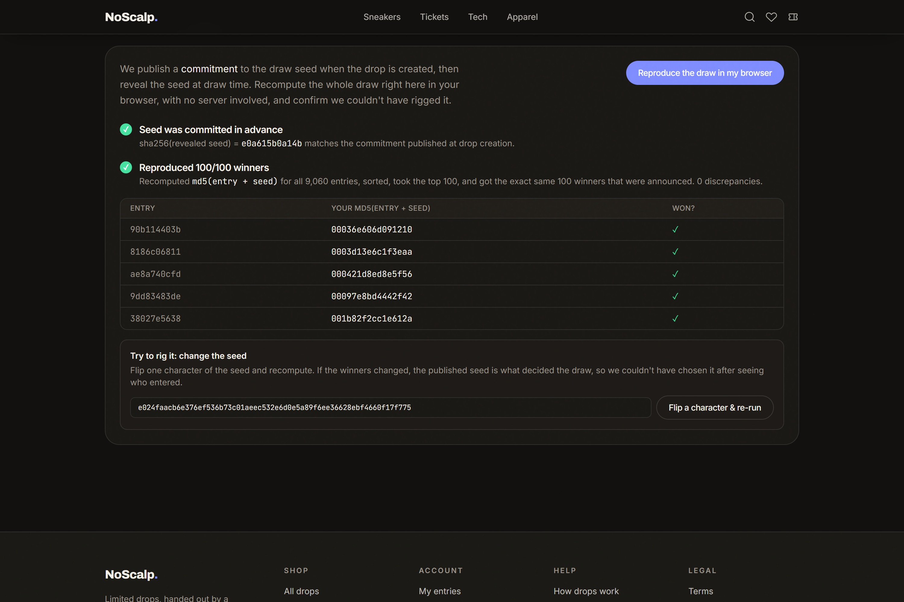
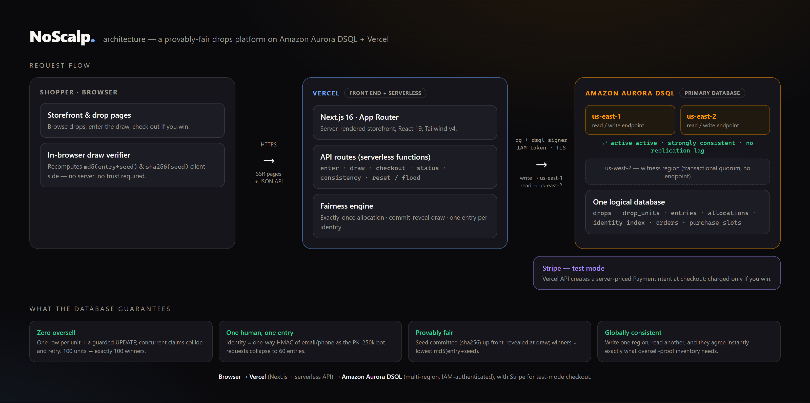

<p align="center">
  
</p>

<h1 align="center">NoScalp — drops, decided fairly</h1>

<p align="center">
  Limited drops, won by real people instead of bots.<br>
  A provably-fair drops platform on <b>multi-region Amazon Aurora DSQL</b> + Vercel.
</p>

<p align="center">
  <a href="https://no-scalp.vercel.app"><b>▶ Live demo</b></a>
  &nbsp;·&nbsp; built for the <b>H0: Hack the Zero Stack</b> hackathon
</p>

> [!NOTE]
> **Judges / reviewers — try it with zero setup.** The live demo is fully open (no login, no token). Open **[/fairness](https://no-scalp.vercel.app/fairness)**, pick a stampede size, and hit **Run the drop**: a normal store oversells past 100 while NoScalp holds at **exactly 100** on Aurora DSQL, with a live `us-east-1 = us-east-2` consistency check. Then click **"Reproduce the draw in my browser"** to verify the result yourself. Browsing and entering a drop work from the [homepage](https://no-scalp.vercel.app) too.

---

Bots win roughly 80% of every hyped drop (concert tickets, sneakers, limited gear) by being faster than humans and by faking thousands of accounts. NoScalp is a drop platform where that doesn't work.

The idea is simple: stop fighting bots on their terms.

1. **Fair lottery, not first-come.** Registration opens a window; winners are drawn at random. Clicking 10,000×/second buys a bot nothing.
2. **One entry per verified human.** A thousand fake accounts collapse to one entry — deduplicated atomically in the database, across every region at once.
3. **Exactly-once allocation.** 100 units means exactly 100 winners and zero oversells, even when two regions write to the same drop in the same millisecond.

All three are **database invariants**, not app-level hopes — which is why this is built on **Amazon Aurora DSQL** (distributed SQL, strong consistency, multi-region active-active).

## The same drop, two ways

<p align="center"></p>

Hit the same drop with a 50,000-request stampede. On the left, a normal store with one inventory counter **oversells** — 127 sold for 100 spots, which means refunds and chargebacks. On the right, NoScalp on Aurora DSQL holds at **exactly 100**, every unit to a real fan, and the 50,000 bot requests collapse to ~60 entries. The `us-east-1 = us-east-2` line is a live cross-region consistency check, run live during the demo.

## Why Aurora DSQL

The hard part of a fair drop isn't the UI — it's correctness under a global stampede. NoScalp runs **active-active across `us-east-1` and `us-east-2`** with a `us-west-2` witness for quorum, as one logical, strongly consistent database. DSQL gives us:

- **Strong consistency across regions.** A write through `us-east-1` is immediately visible through `us-east-2`. No replication lag to oversell into.
- **Optimistic concurrency (no locks).** Conflicting writes are rejected at commit (`40001`) instead of blocking. We lean into this with a schema that almost never conflicts (below) and a retry wrapper for the rare genuine race.

### How the schema makes the guarantees hold

The design rule: **never keep a hot counter, and encode every uniqueness rule as a derived primary key.**

- **Inventory is one row per unit** (`drop_units`), so allocation writes spread across the keyspace — there's no single `stock_remaining` row to contend on, and overselling is structurally impossible.
- **One entry per human** = `entries.id = uuidv5(drop_id + identity_hash)`. A duplicate computes the *same* id and hits `ON CONFLICT (id) DO NOTHING`. The dedup is a single primary-key probe, enforced identically from any region.
- **One verified human** = `identity_index` keyed by an HMAC of the normalized email/phone (gmail dots and `+aliases` stripped).
- **Per-user purchase limit** = one `purchase_slots` row per allowed purchase, keyed by `uuidv5(drop + identity + slot_index)` — a limit with no counter.
- The **draw** is single-leader, idempotent, and seeded with a published value so anyone can recompute it. It paginates to stay within DSQL's 3,000-rows-per-transaction limit.

See [`lib/engine.ts`](lib/engine.ts) for the transactions and [`lib/db/migrations.ts`](lib/db/migrations.ts) for the schema.

## Provably fair — don't trust us, verify it

<p align="center"></p>

When a drop is created, NoScalp publishes a **SHA-256 commitment** to a secret seed. At draw time the seed is revealed, and winners are the entries with the lowest `md5(entry_id || seed)`. Because the commitment is published *before* anyone enters, the seed can't be chosen after seeing who entered — and anyone can **recompute every winner right in their browser** (no server involved) and confirm zero discrepancies. Flip one character of the seed and the winners change completely.

## Architecture

<p align="center"></p>

## Quickstart

```bash
npm install
cp .env.example .env.local   # set NOSCALP_IDENTITY_SECRET; pick local or DSQL
npm run db:migrate           # create tables
npm run db:seed              # seed the demo concert-ticket drop
npm run dev                  # http://localhost:3000
```

- **No AWS handy?** Set `DATABASE_URL` to any Postgres and it runs in local mode (both regions share one DB).
- **Real thing?** Provision Aurora DSQL and set the `DSQL_*` vars — see [SETUP.md](SETUP.md).

## Verify the engine

```bash
npm run test:engine
```

Seeds a drop and asserts the real guarantees: duplicate humans collapse to one entry, a same-human race across two regions yields exactly one entry, a bot flood inserts only distinct identities, the draw produces exactly `stock` winners with **zero oversold** and unique units, double-claims are idempotent, and both regions agree on the totals.

## Routes

- `/` — the storefront
- `/drops/<id>` — the consumer flow: verify → enter → win → checkout (Stripe test mode)
- `/fairness` — the proof: the side-by-side stampede, a live drop log, the "why Aurora DSQL" breakdown, and the in-browser draw verifier. **During the hackathon judging window the demo controls are open** — just hit **Run the drop** (no setup). *(Outside judging they're gated behind operator mode: triple-click the footer wordmark and enter an admin token.)*

## Stack

Next.js 16 (App Router, React 19) on Vercel · Amazon Aurora DSQL (multi-region, IAM-token auth via `@aws-sdk/dsql-signer`) · `pg` · Stripe (test mode) · Tailwind v4 · Framer Motion.
